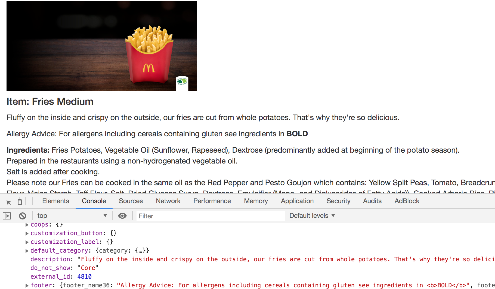

# mcdonalds-api
There seems to be a API at McDonalds.com and it has no documentation, but I'm feeling curious ;) 

- Made basic AJAX call to getItemDetails.htm. error: code: 1001 description: 'Country code cannot be blank.'  
- Code isn't GB. ?country=UK was successful. Now: error: code: 1201 description: 'Item id cannot be blank.'
- error: {code: 1202, description: 'Item id- 1 does not exist for country code- UK.'}
- Items 2, 10, 100, 1000 do not exist
- SUCCESS: We can see at view-source:https://www.mcdonalds.com/gb/en-gb/product/fries-medium.html that the item id for Fries is 200145
- On this page https://www.mcdonalds.com/gb/en-gb/product/fries-medium.html, we can see the image files are located at https://www.mcdonalds.com/content/dam/uk/nutrition/product/pdp-desk/ so add to this: attach_item_thumbnail_image

### Output by my code's request to MackyD's undocumented API:  

